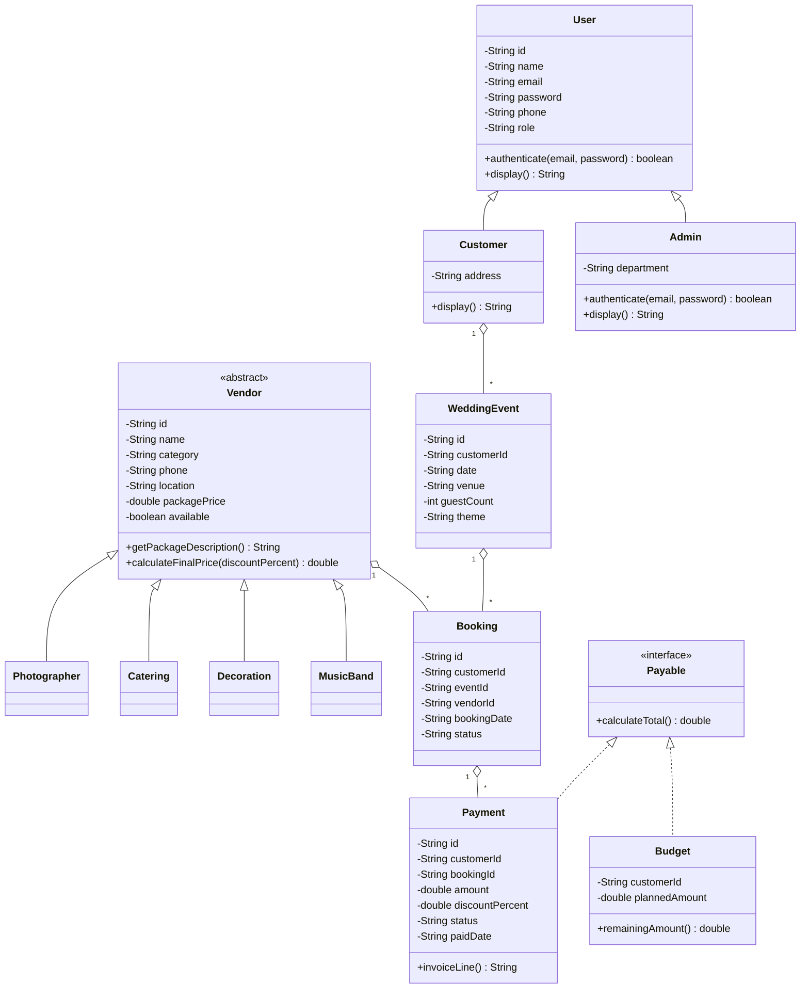

# Wedding Planning & Vendor Booking System

Production-quality Java Spring Boot JSP application for wedding event planning, vendor booking, budget/payment tracking, and admin reporting. The app intentionally uses text files only, with one record per line and `|` as the delimiter.

## Tech Stack

- Java 11
- Spring Boot 2.7.18
- JSP, JSTL, embedded Tomcat
- Bootstrap 5
- Text-file storage in `data/*.txt`

## Run in IntelliJ IDEA

1. Open this folder as a Maven project.
2. Wait for Maven dependencies to import.
3. Run `WeddingPlannerApplication`.
4. Open `http://localhost:8080`.

Demo accounts:

- Customer: `user@wedding.com` / `user123`
- Admin: `rusithanuhas@gmail.com` / `12345`

## Main Routes

- Public home: `/`
- Customer login: `/user/login`
- Admin login: `/admin/login`
- Customer dashboard: `/user/dashboard`
- Admin dashboard: `/admin/dashboard`
- Events CRUD: `/events`
- Vendors CRUD/search: `/vendors`
- Bookings CRUD/status: `/bookings`
- Payments and invoices: `/payments`

## Text Files

- `data/users.txt`: customer accounts
- `data/admins.txt`: admin accounts
- `data/vendors.txt`: vendor records
- `data/events.txt`: wedding events
- `data/bookings.txt`: vendor bookings
- `data/payments.txt`: payment and invoice records

Each service uses `BufferedReader` and `BufferedWriter` through `Files.newBufferedReader` and `Files.newBufferedWriter`. Update and delete operations load records, modify the in-memory list, and rewrite the complete file.

## OOP Concepts Demonstrated

- Encapsulation: all entity fields are private and exposed through getters/setters.
- Inheritance: `Customer` and `Admin` extend `User`; vendor types extend `Vendor`.
- Polymorphism: `display`, `authenticate`, and `getPackageDescription` are overridden.
- Abstraction: `Vendor` is abstract and `Payable` is an interface.
- Aggregation: `WeddingEvent`, `Booking`, and `Payment` connect through customer, vendor, event, and booking IDs.

## UML Class Diagram Description



## Folder Structure

```text
src/main/java/com/weddingplanner
  config/               sample data loader
  controller/           Spring MVC controllers
  model/                OOP entity classes
  service/              text-file CRUD services
src/main/resources
  application.properties
  static/css/app.css
src/main/webapp/WEB-INF/jsp
  auth/ admin/ user/ events/ vendors/ bookings/ payments/
data/
  users.txt admins.txt vendors.txt events.txt bookings.txt payments.txt
```
